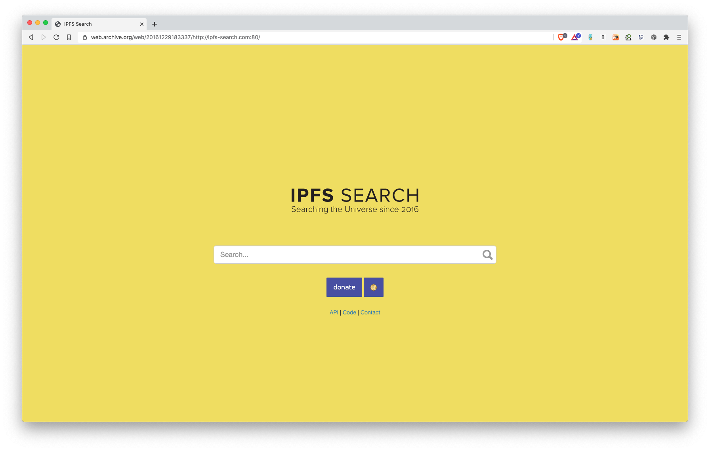
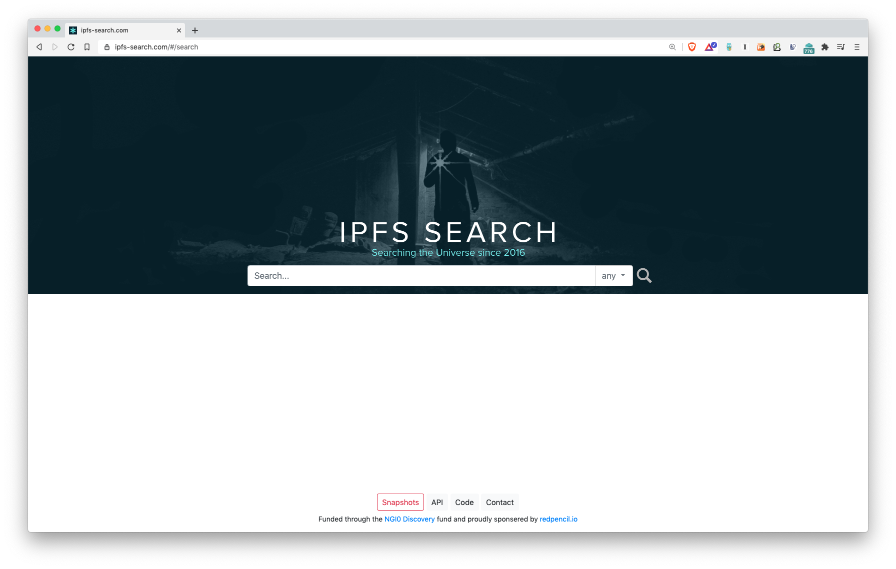
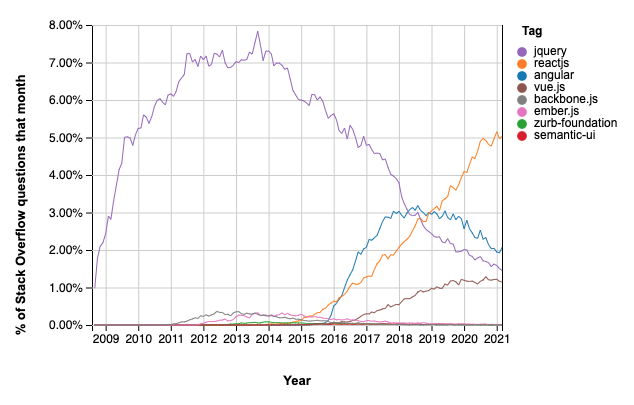
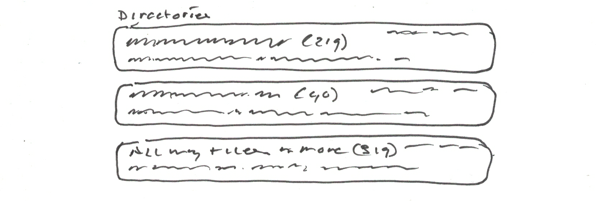
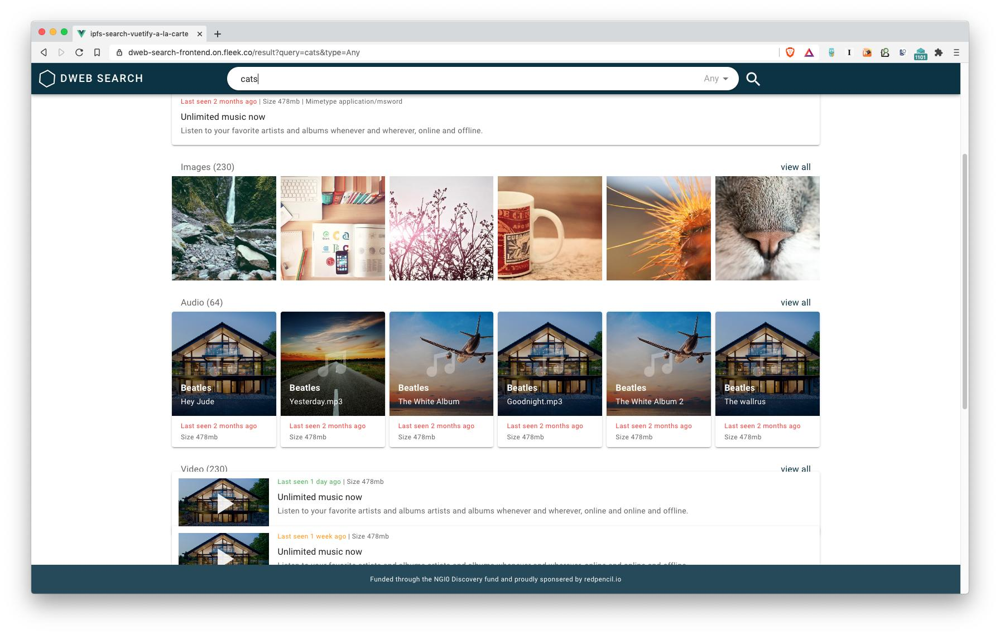

# A brief history of ipfs-search.com
Over the last 5 years, we have been offering our search engine for the decentralized web through two iterations of front-ends, as well as through our [REST API](https://api.ipfs-search.com/). In 2016, we started out with an absolutely minimal frontend for a search engine, both in terms of technology (no framework was used) as well as the user experience and design. Those involved with IPFS for a while might remember the 'traditional' yellow look of our site.

When in 2018 [RedPencil](http://redpencil.io/) joined our project, we decided to develop a new frontend based on [Bootstrap](https://getbootstrap.com/) and [Ember.js](https://emberjs.com/), and a completely new design. Apart from a much better look, it allowed users to select types of content and provided previews of media.

When in 2019 we received a grant from [NLNet](https://nlnet.nl/project/IPFS-search/) through the EU's Next Generation Internet (NGI0) Discovery Fund, we decided once more to do an overhaul of our search engine's user-facing part.

As the IPFS ecosystem and userbase grew, the expectations of our users changed. Whereas until quite recently, a technical background could have been reasonably assumed, this is increasingly no longer the case. As more and more 'regular users' learn about IPFS, more content will be available and with our public-facing site we wish to accommodate these new users' expectations.

In addition, as a true Open Source project, we explicitly invite contributions from other developers to improve what we offer to the world. This includes providing the infrastructure and documentation one may expect from a community project.

This is why we will now present to you our new front-end, in development, which will make ipfs-search.com (soon to be dweb search) easier to use, more reliable and more accessible for outside contributors.

# What's in a name?
You might have noticed in the screenshot above that the name 'IPFS Search' is no longer used, instead we will be migrating towards 'dweb search' once the new front-end goes live.

Of course, we will make a separate announcement about this! For now, it should suffice to explain that the decentralized web is larger than just IPFS!

# Differences between Frontend frameworks

For the third iteration of the UI of IPFS Search we needed to reconsider the choice for a design tool. It is hard to compare frameworks. It is even harder when these frameworks have different focus points.

## Front-end frameworks
A much debated topic in our team was the choice of a front-end framework.

Search is paradoxically complex in interaction, while seemingly simple, users have a tremendous amount of expectations as to what search is supposed to do and how it is to function. What will happen when I enter my query? What will happen when I click on a result? How can I conveniently navigate between results?

As we wish to facilitate users in discovering content on the decentralized web, we have to take our users expectations in mind while we design and develop our public front. This is a challenge, and it is hard to get it right, the first time.

However, when we have to manually take all the consequences of small changes in mind, it becomes increasingly difficult to adapt our user interface, to continually improve on it, without losing track. This is why developers use advanced frameworks such as Angular, React, Ember and VueJS to separate design, interaction and data.

With these frameworks, which all essentially do the same, we can change any of the parts and the whole will adapt (ideally). However, doing so comes at a significant cost; most frameworks, due to their level of abstraction, imply a significant learning curve.

And this was what our debate was about. While none of us particularly liked Angular or React, despite their popularity, it became clear that we had to choose between EmberJS, which some of us have significant experience in, or will we use VueJS, which others have experience in and others are inclined against learning. The JavaScript world is a world of fast-moving things, hypes and trends. Whereas in other many ecosystems it takes years for a library to gain traction, and decades for it to die out, the average life of a JS project is short and brutish. Hence, picking the wrong library may well mean shooting ourselves in the foot, taking months to learn a framework while it may well be [unsupported within a few years](https://docs.angularjs.org/misc/version-support-status).

In the end, the choice led to a shift of roles within the team; those who preferred not to work with VueJS shifted their attention towards other parts of the project. It did take a few deep breaths to get over our differences, to see that making a choice was more important and that nobody had to work with tools they absolutely did not want to. Sometimes, making a decision is more important than the actual content of that decision, and this seems to have been the case here.

We are very happy to have picked a front-end framework with clear concepts, a very active ecosystem and [excellent documentation](https://vuejs.org/v2/guide/) with a fair amount of [long term support](https://github.com/vuejs/roadmap#release-channels-and-lts). Here's a (biased) overview of how [VueJS compares with other frameworks](https://vuejs.org/v2/guide/comparison.html).

## Design frameworks
In addition to the frameworks which tie user interfaces together, we carefully considered various frameworks to facilitate the actual layout of our user interface. A pixel is not a pixel is not a pixel; even after IE died, there are still many slight differences between browsers, there are different screen resolutions and types of devices (phones, phablets, tablets, desktops). In order not to have to reinvent the wheel, and to gain the agility discussed in the previous section, we use frameworks to scaffold the various components a user interacts with.

These are the frameworks we considered for the redesign of our search engine's front-end:

[Bootstrap](https://getbootstrap.com/) comes with lots of pre-build components that are more or less integrated and a grid system based upon flex. Bootstrap focuses on developers with little or no design knowledge. It is offering its users a solid foundation to build further on, hence its name.

[Material Design](https://material.io/) offers a complete design system inspired by the physical world. It has its foundation in the history of design systems and typography. It is a sort of reimagining of the mediums of paper and ink. It offers a very complete set of independent components which are easy to integrate.

[Tailwind](https://tailwindcss.com/) offers lightweight components and a very flexible grid system also based upon flex. It seems that a lot of components that are present in BS and MD by default are missing here. It seems that Tailwind focuses more on experienced frontend developers with solid design knowledge.

After some trials and research we decided to continue with Material Design because it offers the most freedom and flexibility. Because we are working with the Vue framework it was a logical step to choose for [Vuetify](https://vuetifyjs.com/) which is a Vue wrapper around most of the Material Design Components.

The choice for Vuetify makes it easy to expand the frontend team of IPFS Search thanks to the [excellent documetation](https://vuetifyjs.com/en/introduction/why-vuetify/#guide). The framework offers a broad tooling set for both experienced and less experienced frontend developers.

# Supporting different document types

For the different file types like documents, audio and video it would be nice to be able to select the appropriate type together with the query. So that you are able to refine your search results in an instant. In the previous iteration of the UI we used the Bootstrap Input group with Dropdown button built in. This was at the time a bit difficult to tweak, especially in responsive views. We had to use several CSS hacks in order to get things done right.

During the third iteration we had fewer difficulties implementing this pattern. Thanks to the template mechanism in Vue and the scoped wise SCSS approach it was easier to get the desired result. We had to make hardly any exceptions in the default options for the mixed components. It must be said that in later Bootstrap versions the robustness and design of integrated components have also approved a tremendous lot. So it is more a question of trying out new frameworks and techniques and testing them than criticising different frameworks.

# Filetype visibility

In the first version of the IPFS Search UI, we wanted to enable the user to quickly distinguish different file types. We did this through displaying an icon in the list view with the relevant file type. Along with a coloured text to indicate the freshness of the results. In the second iteration we changed this approach by offering a special tailored view for each different file types.

# From sketch to design

Back when we started our work, we used sketches to explore what kind of information we wanted to convey to users, how to best present it to them, and how to best craft the interaction.

And then, nearing the final stages of our design, it looks like this:

# Check it out!
Actually, as an Open Source project, the repository which we're working in is readily available on [GitHub](https://github.com/ipfs-search/dweb-search-frontend).

And, thanks to the good folks over at [Fleek](https://fleek.co/), the latest development version of the frontend is automatically built and published to IPFS. Mind you, so far this is just a mockup; there are no *actual* search results here!

The static version of the frontend is here: [https://dweb-search-frontend.on.fleek.co/](https://dweb-search-frontend.on.fleek.co/)
